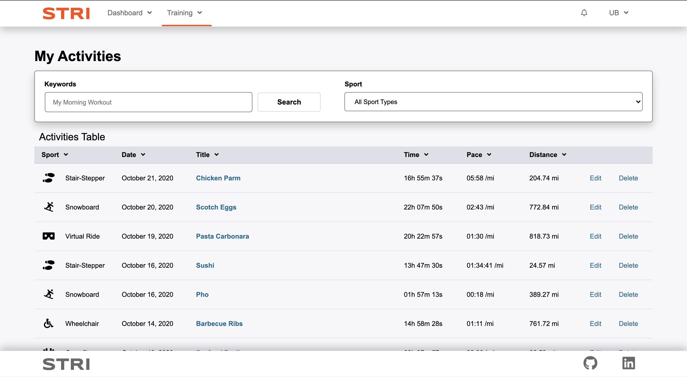

# README

Stri, a Strava clone, is an internet service for tracking exercise and incorporates social networking features. It is mostly used for cycling and running using GPS data.

* Create commonly-followed routes
* Create activities to keep track of progress

Activities and routes can be edited or deleted. They are shown in the users' feed or index pages with a search feature. The demo user's completed activities are shown on their feed below.

### Link to live site: 
https://stri-app.herokuapp.com/#/

Their activities are displayed on the activities index page.

## Technologies

* Frontend: React and Redux
* Backend: Ruby on Rails
* Database: Postgres

## Features

### Searching Activities and Routes
Filter activities and routes by keyword search bar, and by sport type

