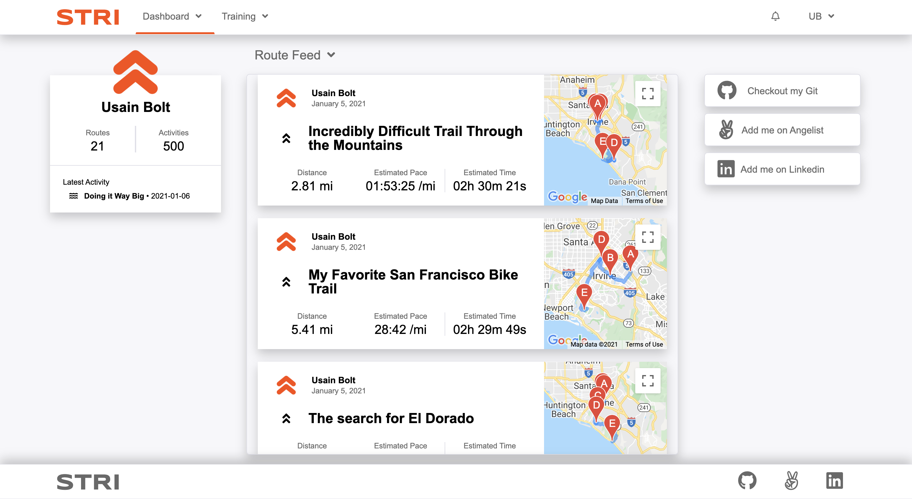
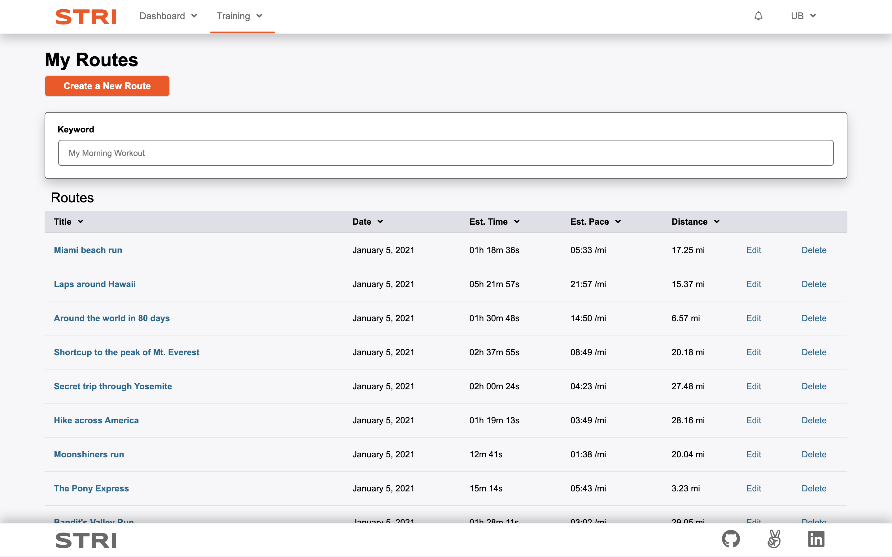
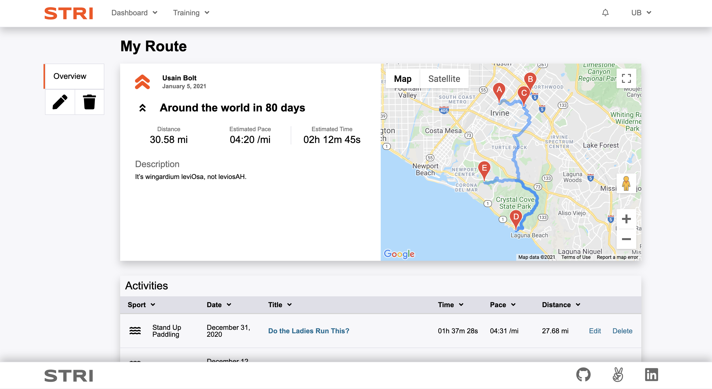
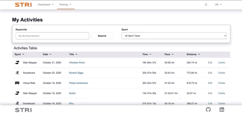

# README 

Stri, a Strava clone, is an internet service for tracking exercise and incorporates social networking features. It is mostly used for cycling and running using GPS data.

* Create commonly-followed routes
* Create activities to keep track of progress

Activities and routes can be edited or deleted. They are shown in the users' feed or index pages with a search feature. The demo user's completed activities are shown on their feed below.

### Link to live site: 
https://stri-app.herokuapp.com/#/



Their routes are displayed on the routes index page.



Custom routes are displayed on route show pages.



## Technologies

* Frontend: React and Redux
* Backend: Ruby on Rails
* Database: Postgres

* Other: Google Maps API, Directions Service API

## Features

### Creating Routes
Google Maps Javascript API, and Google Maps Directions API was utilized to render the map for viewing and creating routes. Users can click anywhere on the map to create new waypoints. The app will dynamically recalculate the distance and estimated duration of the route. Users can delete most recently placed waypoints as needed. Waypoints may also be clicked and dragged for easy editing.


Route waypoints are stored as latitude and longitude columns in separate table in the database.

### Searching Activities and Routes
Users can filter activities and routes by keyword search bar, and by sport type. A debouncing feature was used to allow users to dynamically search without the need to hit submit buttons.

```javascript
    debounce(fn, wait) {
        let timeout;

        return (...args) => {
            const later = () => {
                clearTimeout(timeout);
                fn(...args);
            };

            clearTimeout(timeout);
            timeout = setTimeout(later, wait);
        };
    };
```

Everytime a user types, the closure is executed with new arguments. The outer function variable (the older asynchronous setTimeout) ```timeout``` is cleared and a new asynchronous method is created. ```fn``` is only executed if the user stops typing after the given ```wait``` time.



The search feature is utilized in the activity edit and create feature, allowing users to look up routes to associate an activity with.


### User Show
A user's profile page contains a react-heatmap calendar showcasing all of the user's activities in the past year. The heatmap 

